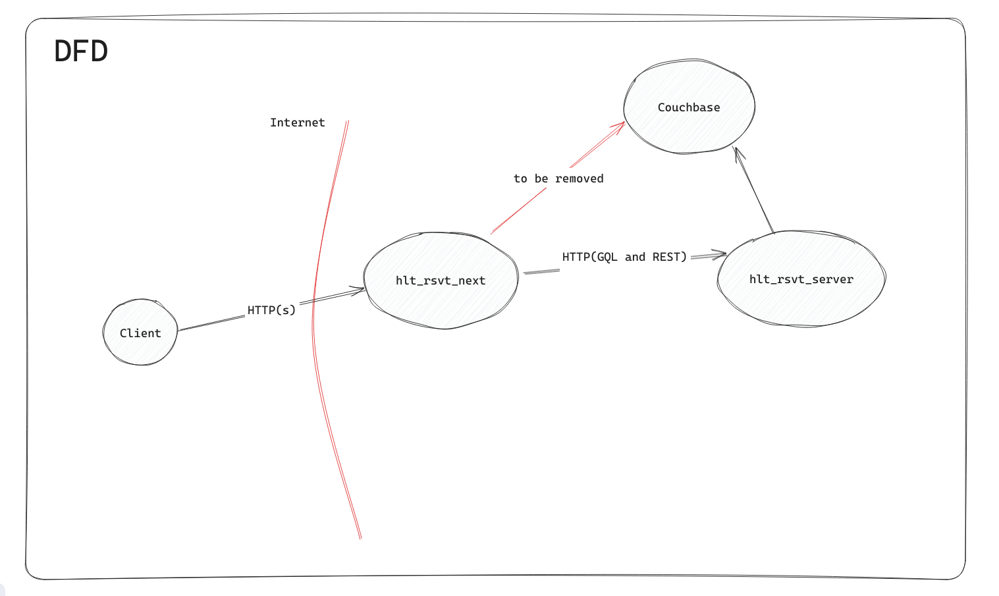

# HLT Reservation App

 - hlt_rsvt_next
 
    Including all front-end codes, and part of data access layer which I plan to replace with REST API client. Built with Next.js.

 - hlt_rsvt_server

    Including GraphQL and RESTful APIs. Built with Nest.js




Due to the time limitation, there are still lots of thing I didn't implemented: unit tests, Playwright for e2e testing, docker files, etc. Hope this project could show the rough ideas of my design.

## Some implicit bussiness rules

1. Customers have to login before making reservations (while the login process should be as easy as possible) - DONE
2. Employees have to login before manipulating reservations - DONE
3. A reservation should have an "expiration", when the reserved time passed and employee didn't mark it as "Done", the reservation should be treated as "Expired". - DONE
4. The seats are not infinite. When a reservation is made, the `available seats` should be decreased by one. - TODO
   - Unlike tickets or goods, we could not simply use a number to represent the `available seats`. We have a `totalCount` of seats, but the `availableCount` is calculated by the reservation's time.
   - To make it simpler, we can assume that every reservation will reserve the seat for 2 hours, for example. Before a reservation is created, a `getAvailableSeats(reservationTime, tableSize)` function should be called, to calculate how many seats have been reserved in the time range.

     Something like:
     ```
     async function getAvailableSeats(reservationTime: number, tableSize: number): Promise<number> {
         const timeFrom = reservationTime - 7200 * 1000;
         const timeUntil = reservationTime + 7200 * 1000;
         // any reservations have time fall in this range are treated as possibly conflict
         const sql = `
             SELECT COUNT(1) FROM reservations WHERE (status = 'pending' OR status = 'preorder') AND tableSize = $1 AND time > $2 AND time < $3
         `;
         const args = [tableSize, timeFrom, timeUntil];
         const reservedCount = await SOME_QUERY(sql, args);
         const availableCount = TOTAL_SEATS[tableSize] - reservedCount;

         return availableCount;
     }
     ```
 5. To avoid some potential concurrent conflict during the available seats calculation, especially when multiple reservations are created at the same time. We may also make the "reservation create" a two-step process. First we create a reservation order with an unique id after the availableCount checks passed. The status of the newly created reservation should be `preorder`. Then we use a message queue to handle the `preorder` one by one, do the checks again before mark it as `pending`.

## How to start locally

Before starting the project, make sure a couchbase instance is ready, you can use a docker image to start it:

```bash
docker run -d --name couch -p 8091-8097:8091-8097 -p 9123:9123 -p 11207:11207 -p 11210:11210 -p 11280:11280 -p 18091-18097:18091-18097 couchbase
```

Visit `localhost:8091` to finish the initial configuration.

Then modify the env file, one in `hlt_rsvt_server` and one in `hlt_rsvt_next`, to match your couchbase instance.

```
# hlt_rsvt_server/.env
HLT_RSVT_COUCH_CONNSTR=couchbase://localhost
HLT_RSVT_COUCH_USERNAME=admin
HLT_RSVT_COUCH_PASSWORD=123456
HLT_RSVT_JWT_SECRET=A_TEST_JWT_SECRET
```

```
# hlt_rsvt_next/.env.local
HLT_RSVT_COUCH_CONNSTR=couchbase://localhost
HLT_RSVT_COUCH_USERNAME=admin
HLT_RSVT_COUCH_PASSWORD=123456
HLT_RSVT_GQL_SERVER_URL=http://127.0.0.1:3001/graphql
HLT_RSVT_REST_SERVER_URL=http://127.0.0.1:3001
```

Or just `cp hlt_rsvt_server/.env.example hlt_rsvt_server/.env` and `cp hlt_rsvt_next/.env.example hlt_rsvt_next/.env.local` as templates.

Then install the deps, start the server and the client:

```bash
cd hlt_rsvt_server
npm i && npm start
```

```bash
cd hlt_rsvt_next
npm i && npm run build && npm start
```

Visit `localhost:3000` to see the app.

At the customer login page, input any phone number, the verification code is always `000000`.

At the employee login page, use `admin` as username, and anything for password.


## Some thoughts during the development

I spent the first two days trying the loopback.js framework. It's an awesome framework for team working, provides a powerful cli tool to generate most boilerplate codes, which helps aligning every developer's codes. It's also an opinionated framework imo. And that's why I gave it up at last. For a small demo project it's a little bit heavy, and for beginner like me it's hard to show my own ideas through it.

Then I put my eyes on Next. I've heard about it a lot but haven't got chances to try it. It seems like very suitable for small project. So I spent the next two days following the tutorial. It was a pleasant experience. The idea of mixing server side rendering and client side rendering is very interesting. But I'm not sure if it's a good choice for a larger project. Accessing database from front-end (although it's placed in a "server-side" part) seems too It may lead to a "big ball of mud" code base very easily. That's why I built a pure back-end server with Nest. Once I found the Next part take too much responsibility, I can easily replace most business logic with RESTful APIs calling.
